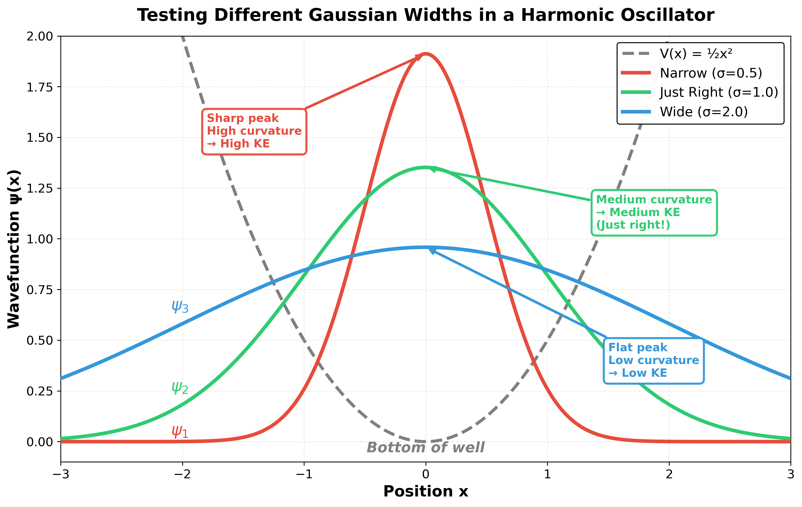
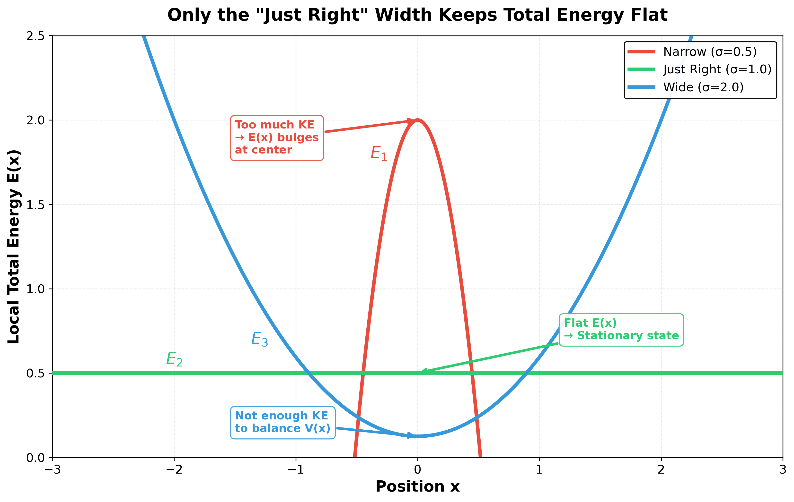

# Quantum Mechanics

## Hand-Wavey Quick Derivation to Schrödinger's Equation

Let's start with a free particle (no potential, just moving in space) and work backwards to get Schrödinger's equation.

### de Broglie Relations (1924)

By the 1920s, light was known to have both wave and particle properties:
- Planck & Einstein showed photons have energy \(E = h\nu\)
- Compton scattering (1923) confirmed photons have momentum \(p = h/\lambda\)

**de Broglie's leap:** If light waves have particle properties, maybe particles have wave properties with the same relations?

For matter waves, we use:

\begin{equation}
E = \hbar\omega, \quad p = \hbar k
\end{equation}

where \(\hbar = h/2\pi\), \(k\) is wave number, and \(\omega\) is angular frequency. Electron diffraction experiments soon confirmed it.

### Free Particle Wave Function

A free particle moving in space can be described as a plane wave. We have two options:

1. **Real wave:** \(A\cos(kx - \omega t)\)
2. **Complex wave (phasor):** \(A e^{i(kx - \omega t)}\)

**Why use the complex form?**

- We know waves interfere (double slit experiment) - they add in and out of phase
- The cosine form can be written as a phasor using Euler's equation: \(e^{i\theta} = \cos\theta + i\sin\theta\)
- We need to calculate probability (which should always be positive, not oscillating between + and -)
- Complex form makes this easy: probability = \(|\psi|^2 = \psi^* \psi\) (multiply by complex conjugate)

So we use:

\begin{equation}
\psi(x,t) = A e^{i(kx - \omega t)}
\end{equation}

### Deriving Schrödinger's Equation

Now let's take derivatives and use the de Broglie relations to connect them.

**Time derivative:**

\begin{equation}
\frac{\partial \psi}{\partial t} = -i\omega \psi
\end{equation}

Using \(E = \hbar\omega\):

\begin{equation}
\frac{\partial \psi}{\partial t} = -i\frac{E}{\hbar}\psi
\end{equation}

Multiply both sides by \(i\hbar\):

\begin{equation}
i\hbar \frac{\partial \psi}{\partial t} = E\psi
\end{equation}

**Spatial derivative (twice):**

\begin{equation}
\frac{\partial^2 \psi}{\partial x^2} = (ik)^2 \psi = -k^2 \psi
\end{equation}

Using \(p = \hbar k\):

\begin{equation}
\frac{\partial^2 \psi}{\partial x^2} = -\frac{p^2}{\hbar^2}\psi
\end{equation}

Multiply both sides by \(-\hbar^2/2m\):

\begin{equation}
-\frac{\hbar^2}{2m}\frac{\partial^2 \psi}{\partial x^2} = \frac{p^2}{2m}\psi
\end{equation}

**Setting them equal:**

For a free particle, classical mechanics says \(E = p^2/2m\). So:

\begin{equation}
E\psi = \frac{p^2}{2m}\psi
\end{equation}

Therefore our two derivative expressions must be equal:

\begin{equation}
i\hbar \frac{\partial \psi}{\partial t} = -\frac{\hbar^2}{2m}\frac{\partial^2 \psi}{\partial x^2}
\end{equation}

**That's Schrödinger's equation for a free particle!**

**What does this mean?** The time derivative extracts energy from the wave, the spatial derivative extracts kinetic energy (from momentum). For a free particle these are the same thing, so we get one equation. It's the quantum version of \(E = p^2/2m\).

### Adding a Potential

If the particle is in a potential \(V(x)\), total energy = KE + PE:

\begin{equation}
i\hbar \frac{\partial \psi}{\partial t} = -\frac{\hbar^2}{2m}\frac{\partial^2 \psi}{\partial x^2} + V(x)\psi
\end{equation}

Or more compactly:

\begin{equation}
i\hbar \frac{\partial \psi}{\partial t} = \hat{H}\psi
\end{equation}

where \(\hat{H} = -\frac{\hbar^2}{2m}\frac{\partial^2}{\partial x^2} + V(x)\) is the Hamiltonian operator.

---

## Building Intuition: From Wave Packets to Stationary States

### Position and Momentum Space (Fourier Transform)

A single plane wave \(e^{ikx}\) extends forever - not realistic for a localized particle.

**Real particles are wave packets.** Consider a state at fixed energy \(E\). We've factored out the time part \(e^{-iEt/\hbar}\), so we're looking at just the spatial part \(\psi(x)\). Start simple - add a few plane waves with different momenta:

\begin{equation}
\psi(x) = A_1 e^{ik_1 x} + A_2 e^{ik_2 x} + A_3 e^{ik_3 x} + \cdots
\end{equation}

Each \(A_n\) tells you the amplitude and phase of momentum \(k_n\). As a sum:

\begin{equation}
\psi(x) = \sum_n A_n e^{ik_n x}
\end{equation}

Now take the limit: spacing between \(k\) values → 0, sum → integral. The discrete amplitudes \(A_n\) become a continuous function \(\tilde{\psi}(k)\):

\begin{equation}
\psi(x) = \int_{-\infty}^{\infty} \tilde{\psi}(k) e^{ikx} dk
\end{equation}

That's the **Fourier transform**. \(\tilde{\psi}(k)\) tells you "how much of momentum \(k\)" is in your wave packet.

**Key insight:** You can't have both narrow at once.
- Narrow in position (localized) → wide spread in momentum
- Narrow in momentum (definite p) → spread out in space
- This is the **uncertainty principle**!

**Quick derivation:** From Fourier theory (like time-bandwidth product in signal processing), a wave packet localized to width \(\Delta x\) needs a spread in \(k\) of roughly \(\Delta k \sim 1/\Delta x\). Since \(p = \hbar k\), we have \(\Delta p = \hbar \Delta k\), giving:

\begin{equation}
\Delta x \cdot \Delta p \sim \hbar
\end{equation}

The rigorous proof (using the commutator \([\hat{x},\hat{p}] = i\hbar\)) gives \(\Delta x \cdot \Delta p \geq \hbar/2\).

### Time-Independent Schrödinger Equation

Now let's think about the **time derivative** in Schrödinger's equation.

From \(i\hbar \frac{\partial \psi}{\partial t} = E\psi\), we see: higher energy → faster time oscillation.

For states with **definite energy** (energy eigenstates), we can separate variables:

\begin{equation}
\psi(x,t) = \psi(x) e^{-iEt/\hbar}
\end{equation}

The time part is just a rotating phase \(e^{-i\omega t}\) where \(\omega = E/\hbar\). All the physics (probability, where the particle is) lives in \(\psi(x)\).

Plug this back into Schrödinger's equation:

\begin{equation}
i\hbar \frac{\partial}{\partial t}\left[\psi(x) e^{-iEt/\hbar}\right] = \hat{H}\left[\psi(x) e^{-iEt/\hbar}\right]
\end{equation}

The time derivative just brings down \(-iE/\hbar\), which cancels the \(i\hbar\), leaving:

\begin{equation}
E\psi(x) = \hat{H}\psi(x)
\end{equation}

Or written out fully:

\begin{equation}
-\frac{\hbar^2}{2m}\frac{d^2\psi}{dx^2} + V(x)\psi = E\psi
\end{equation}

**That's the time-independent Schrödinger equation.** It's an eigenvalue equation: find the functions \(\psi(x)\) and energies \(E\) that satisfy it.

### Intuition: Wiggliness vs Potential

Here's the key physical insight from the time-independent equation.

Start with the Schrödinger equation and **divide both sides by ψ**:

\begin{equation}
-\frac{\hbar^2}{2m}\frac{\psi''}{\psi} = E - V(x)
\end{equation}

Now the physics is crystal clear:

**Left side:** The second derivative ψ'' measures how much the wavefunction curves. Dividing by ψ itself gives the **local kinetic energy**.

**Right side:** Since total energy E = KE + PE, we have KE = E - V(x).

**Why divide by ψ?** When you localize (squeeze) a wavefunction, two things happen: it gets taller (higher amplitude at the peak) and sharper (higher curvature). Dividing by ψ separates these effects — ψ''/ψ captures just the sharpness of the curve, independent of the overall height. This is what determines the kinetic energy.

**What this means:**

- **Low potential** (V small) → right side is large → ψ''/ψ is large → ψ is very wiggly
- **High potential** (V large) → right side is small → ψ''/ψ is small → ψ is less wiggly

The equation literally says: **the curvature of ψ (relative to its value) equals the local kinetic energy**!

When you solve for ψ(x), it automatically adjusts its wiggliness to match the kinetic energy at each point. In regions where potential is low, the wavefunction oscillates rapidly. Where potential is high, it oscillates slowly (or even decays exponentially if V > E).

---

## Why Can't a Particle Just Sit at the Bottom of a Well?

### Classical vs Quantum Ground State

**Classical intuition:** If you put a ball in a bowl (harmonic oscillator potential), the lowest energy state is the ball sitting still at the bottom. Total energy = 0.

**Quantum reality:** This doesn't work! Here's why.

If we try to localize the particle tightly at the bottom of the well (making ψ very narrow), the wavefunction has **high curvature**. From the Schrödinger equation divided by ψ:

$$
-\frac{\hbar^2}{2m}\frac{\psi''}{\psi} = E - V(x)
$$

Squeezing ψ narrow increases its curvature ($\psi''$), making the left side large. This means the kinetic energy $E - V(x)$ shoots up at the center, so $E(x) = \text{KE}(x) + V(x)$ is not constant — meaning it's **not a stationary state**.

### Finding the "Just Right" Width

Let's test three different Gaussian trial wavefunctions with different widths:

- **ψ₁ (narrow, red):** Sharp peak → high curvature at center → high KE
- **ψ₂ (medium, green):** "Just right" width — balances spread vs curvature
- **ψ₃ (wide, blue):** Flat peak → low curvature → low KE

Now let's check which one gives constant total energy $E(x) = \text{KE}(x) + V(x)$:

- **E₁ (red):** Too much KE → $E(x)$ bulges at center (not constant!)
- **E₂ (green):** Nearly flat $E(x)$ → this is a **stationary state**!
- **E₃ (blue):** Not enough KE to balance the rising potential $V(x)$ → $E(x)$ varies

### The Zero-Point Energy

Only ψ₂ (the "just right" width) gives approximately constant $E(x)$ — this is the **ground state** of the harmonic oscillator. Notice:

1. The wavefunction **spreads out** (can't be localized to a point)
2. The particle has **kinetic energy even in the ground state**
3. For this specific potential ($V = \frac{1}{2}m\omega^2 x^2$), the minimum energy is $E_0 = \frac{1}{2}\hbar\omega$, **not zero**

This minimum energy is the **zero-point energy** — a purely quantum effect arising from the uncertainty principle. If you try to confine the particle too tightly (small Δx), its momentum uncertainty Δp increases, giving it kinetic energy. The ground state is the perfect balance between being localized enough to stay near the potential minimum, but spread out enough to avoid excessive kinetic energy.

**Key insight:** The time-independent Schrödinger equation is essentially saying "find the wavefunction shape where curvature (KE) and potential energy add up to the same constant everywhere." Only specific shapes (eigenstates) and energies (eigenvalues) work!

---

## The Harmonic Oscillator: Explicit Solutions

Now that we understand why the ground state can't be at the bottom, let's see the actual solutions for the harmonic oscillator potential $V(x) = \frac{1}{2}m\omega^2 x^2$.

### Energy Levels

The allowed energies are:

\begin{equation}
E_n = \hbar\omega\left(n + \frac{1}{2}\right), \quad n = 0, 1, 2, ...
\end{equation}

Notice:
- **Evenly spaced** by ℏω (like a ladder!)
- **Ground state** (n=0): $E_0 = \frac{1}{2}\hbar\omega$ (the zero-point energy we saw)
- **First excited** (n=1): $E_1 = \frac{3}{2}\hbar\omega$
- **Second excited** (n=2): $E_2 = \frac{5}{2}\hbar\omega$

### The Wavefunctions in Position and Momentum Space

For convenience, define: $x_0 = \sqrt{\hbar/(m\omega)}$ (length scale) and $p_0 = \sqrt{m\hbar\omega}$ (momentum scale).

Notice: $x_0 \cdot p_0 = \hbar$ (uncertainty principle saturated).

**n=0 (Ground state): E₀ = ½ℏω**

Position space:
\begin{equation}
\psi_0(x) = \left(\frac{1}{\pi x_0^2}\right)^{1/4} e^{-x^2/(2x_0^2)}
\end{equation}

Momentum space:
\begin{equation}
\tilde{\psi}_0(p) = \left(\frac{1}{\pi p_0^2}\right)^{1/4} e^{-p^2/(2p_0^2)}
\end{equation}

Both Gaussians! Fourier transform of a Gaussian is a Gaussian. This is the "just right" width we found — equally spread in x and p.

**n=1 (First excited): E₁ = 3/2ℏω**

Position space:
\begin{equation}
\psi_1(x) = \left(\frac{1}{4\pi x_0^2}\right)^{1/4} \frac{2x}{x_0} e^{-x^2/(2x_0^2)}
\end{equation}

Momentum space:
\begin{equation}
\tilde{\psi}_1(p) = \left(\frac{1}{4\pi p_0^2}\right)^{1/4} \frac{2p}{p_0} e^{-p^2/(2p_0^2)}
\end{equation}

One node at origin (antisymmetric). Same functional form in both spaces!

**n=2 (Second excited): E₂ = 5/2ℏω**

Position space:
\begin{equation}
\psi_2(x) = \left(\frac{1}{16\pi x_0^2}\right)^{1/4} \left(\frac{4x^2}{x_0^2} - 2\right) e^{-x^2/(2x_0^2)}
\end{equation}

Momentum space:
\begin{equation}
\tilde{\psi}_2(p) = \left(\frac{1}{16\pi p_0^2}\right)^{1/4} \left(\frac{4p^2}{p_0^2} - 2\right) e^{-p^2/(2p_0^2)}
\end{equation}

Two nodes (symmetric). Again, same functional form!

**Pattern:** Higher n → more nodes → more wiggly → higher energy. The harmonic oscillator has beautiful symmetry between position and momentum.

---

## One Wavefunction, Many Faces: Basis Decomposition

Here's something remarkable: we've been showing the ground state ψ₀(x) in position space, and ψ̃₀(p) in momentum space. But these are **the same quantum state** — just written in different "languages"!

Think about it: a vector like [3, 4] can be expressed in Cartesian coordinates (x,y) or polar coordinates (r,θ). Same vector, different representation. Quantum states work the same way.

### The Same State, Three Ways

Let's take a concrete example: suppose we prepare a harmonic oscillator in its **first excited state** (n=1).

**In the energy basis:**

The state is simply "I'm in energy level 1":

\begin{equation}
|\psi\rangle = |n=1\rangle
\end{equation}

That's it! The energy basis is the "simplest" way to describe this state because it's an energy eigenstate.

**In the position basis:**

The "how much at each position x" description is:

\begin{equation}
\psi(x) = \left(\frac{1}{4\pi x_0^2}\right)^{1/4} \frac{2x}{x_0} e^{-x^2/(2x_0^2)}
\end{equation}

This continuous function tells you the amplitude at every point in space.

**In the momentum basis:**

The "how much of each momentum p" description is:

\begin{equation}
\tilde{\psi}(p) = \left(\frac{1}{4\pi p_0^2}\right)^{1/4} \frac{2p}{p_0} e^{-p^2/(2p_0^2)}
\end{equation}

Same quantum state, just expressed in terms of momentum components.

### Superposition in Action

Now here's where it gets interesting. Consider a state that's **not** an energy eigenstate:

\begin{equation}
|\psi\rangle = \frac{1}{\sqrt{2}}|n=0\rangle + \frac{1}{\sqrt{2}}|n=1\rangle
\end{equation}

This is a **superposition** of ground and first excited states.

**What does this look like in position space?**

Add the two wavefunctions (with their time evolution):

\begin{equation}
\psi(x,t) = \frac{1}{\sqrt{2}}\psi_0(x)e^{-iE_0 t/\hbar} + \frac{1}{\sqrt{2}}\psi_1(x)e^{-iE_1 t/\hbar}
\end{equation}

The probability density |ψ(x,t)|² now **oscillates in time** — the wavefunction sloshes back and forth in the well! This is because the two energy components have different time-evolution frequencies.

**What does this look like in the energy basis?**

Super simple:

\begin{equation}
c_0 = \frac{1}{\sqrt{2}}, \quad c_1 = \frac{1}{\sqrt{2}}, \quad c_2 = 0, \quad c_3 = 0, \quad ...
\end{equation}

Just a list of coefficients! This is like writing a vector: $|\psi\rangle = [1/\sqrt{2}, 1/\sqrt{2}, 0, 0, ...]^T$

### Operators: Extracting Information

Now we can understand what operators do. An **operator** is a mathematical object that extracts a specific type of information from a state.

**Position operator** x̂:
- In position basis: multiply by x (trivial!)
- "Where is the particle?" — gives ⟨x⟩ = ∫ x|ψ(x)|² dx

**Momentum operator** p̂:
- In position basis: $\hat{p} = -i\hbar \frac{\partial}{\partial x}$ (acts on ψ(x))
- In momentum basis: multiply by p (trivial!)
- "What momentum does it have?" — gives ⟨p⟩ = ∫ p|ψ̃(p)|² dp

**Energy operator** (Hamiltonian) Ĥ:
- In energy basis: multiply by Eₙ (trivial!)
- "What energy does it have?" — gives ⟨E⟩ = Σ |cₙ|² Eₙ

**Key pattern:** Every operator has a basis where it's simple (just multiplication). These are its **eigenstates**.

### Measurement: Projecting onto a Basis

Here's the quantum measurement postulate in simple terms:

**When you measure an observable (represented by operator Â):**

1. **Decompose** the state in the eigenbasis of Â:
   $$|\psi\rangle = \sum_i c_i |\lambda_i\rangle$$
   where |λᵢ⟩ are eigenstates of  with eigenvalues λᵢ

2. **You get one of the eigenvalues** λᵢ as the measurement result

3. **Probability of getting λᵢ is** |cᵢ|²

4. **After measurement, the state collapses** to |λᵢ⟩

**Example:** Measure energy of our superposition state $|\psi\rangle = \frac{1}{\sqrt{2}}|0\rangle + \frac{1}{\sqrt{2}}|1\rangle$:
- 50% chance: get E₀ = ½ℏω, state becomes |0⟩
- 50% chance: get E₁ = 3/2ℏω, state becomes |1⟩

### Introducing Dirac Notation

We've been sneaking in this |ψ⟩ notation (called "ket"). Here's what it means:

**Ket |ψ⟩:** An abstract quantum state (independent of basis)

**Bra ⟨φ|:** The dual vector (used for inner products)

**Inner product ⟨φ|ψ⟩:** Overlap between states (gives a number)

**In position basis:**
- |ψ⟩ becomes the function ψ(x)
- ⟨x|ψ⟩ = ψ(x) (amplitude at position x)
- ⟨φ|ψ⟩ = ∫ φ*(x)ψ(x) dx

**In energy basis:**
- |ψ⟩ becomes the vector [c₀, c₁, c₂, ...]ᵀ
- ⟨n|ψ⟩ = cₙ (coefficient of energy eigenstate n)
- ⟨φ|ψ⟩ = Σ dₙ* cₙ

**Why use this notation?**
- **Basis-independent:** |ψ⟩ is the same whether you write it in position, momentum, or energy basis
- **Clean math:** ⟨n|Ĥ|ψ⟩ means "apply Ĥ to |ψ⟩, then project onto |n⟩"
- **Matrices emerge naturally:** ⟨m|Ĥ|n⟩ is the (m,n) matrix element of Ĥ

### The Bridge to Matrices

In a finite-dimensional space (like spin, or truncating to the first N energy levels), everything becomes linear algebra:

**States** → column vectors:
$$|\psi\rangle = \begin{pmatrix} c_0 \\ c_1 \\ c_2 \\ \vdots \end{pmatrix}$$

**Operators** → matrices:
$$\hat{H} = \begin{pmatrix} E_0 & 0 & 0 & \cdots \\ 0 & E_1 & 0 & \cdots \\ 0 & 0 & E_2 & \cdots \\ \vdots & \vdots & \vdots & \ddots \end{pmatrix}$$

**Eigenvalue equation** Ĥ|ψ⟩ = E|ψ⟩ → matrix equation H**c** = E**c**

**Time evolution** → matrix exponential:
$$|\psi(t)\rangle = e^{-i\hat{H}t/\hbar}|\psi(0)\rangle$$

This is **the same Schrödinger equation** you know, just in matrix form!

The continuous wavefunctions ψ(x) we've been working with are the infinite-dimensional limit. The math structure is identical.

---

*Next up: We'll explore the simplest quantum system — spin-1/2 — where everything is 2×2 matrices, and all of quantum mechanics fits in a tiny box. This is the foundation of qubits and quantum computing.*
